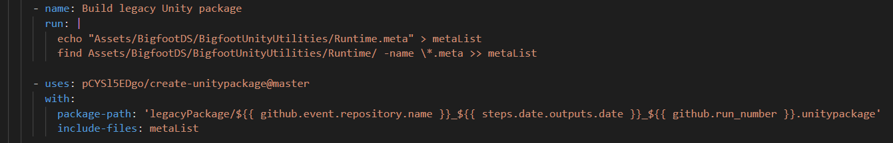
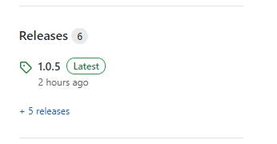
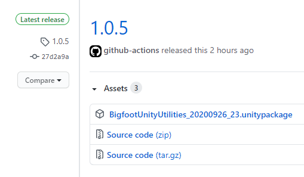

# Automated Unity Package Generation with Github Actions

Example of using Github Actions to generate Unity UPM & legacy packages from a Unity project hosted in a Github repository.

This is mainly an educational example - the project, workflow & results are all visible.


## What is this?

The Unity project itself is an example of some code you might want to use across multiple different projects - a resource, that you would use via a package file or package manager! All of the fancy stuff shown here relies on Github Actions, which means your project must be hosted as a git repository available on Github.

The Unity project is right in the root of the repository - if you're a GUI-using git user, this means you typically have to make a Unity project, open it, make a Github repo through Github Desktop, and copy the contents of your Unity project into the repo folder. You could, if you know which names & filepaths to change, just copy the whole Unity project into a git repo as a nested folder. But that's not as pretty to look at.

Anyway, what is this really about? Well, we want to make our Unity projects shareable & usable as packages! Packages are a bit of a weird thing - for a long time, Unity had a system where a ".unitypackage" file was your package. It was basically just a ZIP file. You had to manually get it, keep it updated, unpack it in to your project, etc etc, all yourself. 

If you step away from the Unity sphere of software development, you might notice that *that* type of "package" system is not really commonly used. Instead, you'll see systems like NPM for JavaScript, PIP for Python, and Gems for Ruby. Those package systems can support complex packages - packages that rely on other packages. This makes it easier for developers to create & share packages that can do more-complex things, and makes it easy to maintain with good versioning & dependency management - especially when compared to the traditional "basically just a ZIP" approach to packages.

Unity's new package manager system (UPM) is built on NPM - but as it's new, it's not commonly used yet across the various asset & package developers. The old, legacy package system is still burned into everyone's brains, everyone who is making packages still knows how to use that system - but it's better for everyone to learn about & move over to the new system too. So, this repository is set up to support both package systems. When you push a commit & tag it with a semantic version number, it will generate both a ".unitypackage" file and update the package used by UPM.

The Unity project itself isn't the key focus, but there are some things to note in it (which we'll explain in the "*UPM Notes*" section). The real important juicy stuff here comes from the Github Actions workflow file named "unitypackage.yml", located in ".github/workflows". Here, you can see lots of YAML that will generate both a legacy Unity package ".package" file, as well as deploy the project to a "upm" branch that can be used in the Unity Editor's package manager system. 


## Accessing the packages

The two package systems have different methods for you to follow in order to use your desired package:

### Legacy Package System

The legacy Unity package file is available in the releases section of this repository. 

To use a legacy Unity package, you must download it, and then follow the steps in this guide: https://docs.unity3d.com/Manual/AssetPackagesImport.html

### Unity Package Manager System

The UPM package is available through this git URL: https://github.com/AlexHolderDeveloper/BigfootUnityUtilities.git#upm 

To use a UPM package based on its git URL, you must follow the steps in this guide: https://docs.unity3d.com/Manual/upm-ui-giturl.html 


## How this works

This is almost-entirely driven by the Github Actions automation system. In the root of this repository, you'll be able to find a ".github" folder with contents like this:


That "unitypackage.yml" file handles the creation of the legacy Unity package file & deployment of the UPM package repository. If you were so inclined, you could even set up automated test running in the workflow as well! Github Actions provides a lot of powerful tools to you & your projects.

The YML file can be broken down into these key segments:

1. The initialization.


Here, we can declare some stuff that will be helpful for us monitoring the automation results. A nice useful action name, generic "always-good" options for the running operating system, and the required "checkout the repository via premade actions/checkout Github Actions script" is a must-do before working on anything related to your repository contents.

We also retrieve the current date (year-month-day) for use in naming our output. That step can be skipped depending on how you're handling semantic version numbering.

Then, we have to make sure that we have a directory to store our output of the legacy package creation step. This directory is temporary and we don't directly access it ourselves, but our build process needs somewhere to store the results until it gets moved to the repository's "Releases" section.


2. Push out the current project as a UPM package.


This step can go anywhere in the process, but it's nice to get it out of the way early in case something goes wrong in the legacy package creation step & halts the Github Action workflow.

Basically, this is using another premade Github Actions script (the "s0/git-publish-subdir-action@develop" part) to push out a specified folder as its own branch. We can then use that branch directly in our UPM system via a git URL.

The git URL has a specific syntax:

``` https://github.com/<user>/<project>.git#<branch>``` 

A URL like this points to our newly-made or freshly-updated "upm" branch, and we can tell all of our package users to use this URL when adding the package to their project:

``` https://github.com/AlexHolderDeveloper/BigfootUnityUtilities.git#upm  ```

However, it must be made super clear: if you don't specify the branch, the URL will not work for you unless you've completely reworked your repository in a specific structure. By default, a git URL without a specified branch will just use the "master" branch - and that won't work. The reason for that is that Unity expects all UPM packages to have a certain structure to them, as well as requires specific files & data. In this project, our "BigfootUnityUtilities" folder has a very specific structure based on Unity's official UPM packages. We'll cover that in the "*UPM Notes*" section.

If you change the BRANCH value from "upm" to something else, then you must make sure that the branch specified in the git URL matches that branch.

Also, while it does use a "secrets.GITHUB_TOKEN" variable, note that Github generates that. It's purely to make sure that your repository is running your workflow file.


3. Build the legacy Unity package 



This is technically two steps, I know. 

The first part is building a list of files that you would bundle up into your package (similar to how you'd have to select all files in the Project tab if you were making a legacy package via the Unity Editor). 

Then, we can use another premade Github Action script (the "pCYS15EDgo/create-unitypackage@master" part) to basically zip up all of those selected files into a ".unitypackage" file.

There's some cool stuff going on in the package name - we have to specify the directory & name in the "package-path" property of the ".unitypackage", and it's also the part where we can insert our semantic version numbering & whatever other naming techniques you'd like to use into the name of the legacy package.

For us, this workflow file will make a legacy Unity package named:

```  BigfootUnityUtilities_20200926_23.unitypackage```

Where our file is using:

* The repository name as the leading part of the file name
* The current date to help identify builds (replace this with your semantic versioning of choice!)
* The amount of times that the Github Action that generates the legacy package has been run. Again, if you're using semantic version numbering, this would be replaced.


4. Upload the legacy Unity package to the repository Releases section 


This is another two-part step: it must first upload files in preparation of a release (with the premade Github Actions script "action/upload-artifact@master"), and then make a release pointing to those files (with the premade Github Actions script "fnkr/github-action-ghr@v1").

The first part looks for all files in the "legacyPackage" directory - which will only just have our freshly-made legacy Unity package file in it. Releases always also provide the source code (the current contents of the repository) in both ZIP and TAR.GZ formats, but that's done by Github - not us/you.

The second part makes sure that it only creates a new release IF our commit is tagged. You can read more about tagging your commits here: 

* Github Desktop commit tagging: https://docs.github.com/en/free-pro-team@latest/desktop/contributing-and-collaborating-using-github-desktop/managing-tags 
* Git CLI commit tagging: https://www.atlassian.com/git/tutorials/inspecting-a-repository/git-tag

 This is another part where your semantic version numbering can be useful - the version numbering shows up all over the web version of the repository.

On the right of the main page of your repository, you'll see this:



And if you click through to your Releases section, you'll see this:



But that's it - once you can see your legacy Unity package in your Releases section on the web view of your repository, you have both a legacy Unity package & a UPM-ready package! Woo! 


## UPM Notes

To make sure you're making UPM packages that meet Unity's standards (eg. if you wanna publish it to their official registry or look good on the Unity Asset Store), you should make sure your package has a few things.

**First, a good structure! Have a look at this:**


You might've seen this structure before - it's what Unity uses in their own official packages. Basically, your package must be organized in a way that it's easy for others to use, and organized in a way that's easy to meet Unity's requirements for officialness (if you are aiming for that).

This structure encourages & facilitates you in writing documentation & tests, which are crucial for larger & more-complex packages. It also defines a clear line between Editor code & Runtime code - no more mixing in multiple Editor directories throughout your Runtime code!

The CHANGELOG file is something worth automating - you could fill that file with every commit message from your repository! (Yes, this means your commit messages MUST be useful! Hah!)

The README file commonly serves as a hub to more markdown or PDF files found in the Documentation folder - though it's really up to you there.

You can read more about the folder & file structure on the Unity documentation, available here: https://docs.unity3d.com/Manual/cus-layout.html


**Second, your UPM package needs the contents to match that structure!**

You should specify a good licence - depending on what you're building, you may want a specific type of licence as explained here: https://choosealicense.com/

But, crucially, you must have specific contents in the package.json file there. Yes, it's a "package.json" just like the ones you'd see in NPM. This means it MUST be filled out correctly if you ever expect to publish your UPM package on to any package registry!

Here's what the package.json file looks like for this repository's UPM package:


You can look at the package.json rules & requirements in the Unity documentation, available here: https://docs.unity3d.com/Manual/upm-manifestPkg.html

It's important to have useful, correct information in this file! Some of this data is visible in the Unity Editor, in the the Package Manager window like so:


Lovely developer Naga Chiang also has a good write-up on the package.json & other helpful bits on making your own UPM package - check out their write-up here: https://nagachiang.github.io/tutorial-working-with-custom-package-in-unity-2019-2/


## Resources used:

* The "create-unitypackage" action from the Github Marketplace, by Github user pCYSl5EDgo. Link: https://github.com/marketplace/actions/create-unitypackage
* The "Github Releases" action from the Github Marketplace, by Github users fnkr, harshzalavadiya, and rokibhasansagar. Link: https://github.com/marketplace/actions/github-releases 
* The "Push git subdirectory as branch" action from the Github Marketplace, by Github users s0, nyoom, KyrietS, and kikisix. Link: https://github.com/marketplace/actions/push-git-subdirectory-as-branch
* Info about Unity's new UPM structure from Naga Chiang. Link: https://nagachiang.github.io/tutorial-working-with-custom-package-in-unity-2019-2/ 
* Unity UPM package layout: https://docs.unity3d.com/Manual/cus-layout.html
* Unity UPM package.json requirements: https://docs.unity3d.com/Manual/upm-manifestPkg.html


# TODO

* Automated semantic versioning. Yeah, I know.


